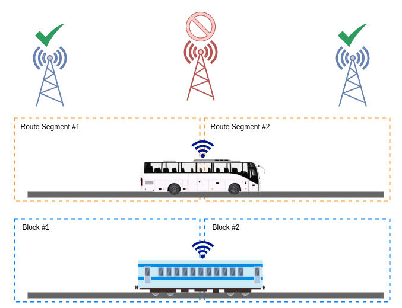

<p align="center">
  
</p>

# Route-Lock Cellular Enforcement (RLCE)
**Version 1.1**  
Author: Michael "Mike" Curnow  
Date: September 9 2025

---

## 1. Scope
This specification defines Route-Lock Cellular Enforcement (RLCE), a mechanism for constraining User Equipment (UE) to transmit data only over authorized cells that are valid along a pre-defined operational path. RLCE is designed for use in safety-critical and availability-sensitive domains including but not limited to:
- Public transit vehicles (buses, light rail, metro/subway)
- Freight rail
- Commercial fleet vehicles (trucks, tractor-trailers, delivery vans)
- Autonomous vehicles and robo-taxis (e.g., Waymo, Cruise)
- Any safety- or business-critical mobile system relying on cellular connectivity

All of these modes share a common feature: they follow static or semi-static routes with repeatable cell patterns. For example, GoRaleigh buses on Route 100 traverse the same stops and pass through the same TACs every day, making them ideal candidates for RLCE enforcement.



***

## 2. Rationale
Cellular networks have been allowed to remain a vast, unguarded blind spot for far too long. The industry has collectively shrugged at the risk, letting flawed trust models persist because “that’s how it’s always been done.” Developers fall back on inherited design patterns that deliberately sidestep the cellular attack surface, and entire sectors operate under the comforting lie that this problem belongs to someone else. That time is over. It is our problem, here and now.  

Despite decades of IMSI catcher research, operational countermeasures remain rare in production systems. Some commercial equipment, like Mikrotik modems, now includes basic cell-lock features - a promising start, but far from a holistic solution. RLCE extends this concept into a rigorous, route-based enforcement framework.  

IMSI catchers and rogue base stations are not just tools for surveillance. They are weapons that can degrade, disrupt, and deny service to connected vehicles in motion - buses dropping telemetry, freight trains losing signaling integrity, autonomous fleets going dark in the middle of operations. This is not theoretical. These are vulnerabilities that translate directly into safety hazards, operational breakdowns, and public trust failures.  

RLCE answers this threat head-on. It treats cellular conduits as security boundaries in their own right, enforcing C6’s Safety, Availability, Integrity, and Confidentiality at the lowest level where it matters: the connection itself. RLCE does not wait for regulators to catch up, nor does it trust that carriers will design away the risks. Like its sibling CSIV, RLCE assumes no cavalry is coming. It is a technical fix for a technical problem, built in userspace so it can be deployed now - by operators, engineers, and fleets that understand the stakes.  

This is not a matter of convenience or optimization. It is a matter of refusing to let critical infrastructure remain at the mercy of whoever can power up a rogue cell tower in the wrong place at the wrong time. For example, if a rogue eNodeB were deployed along GoRaleigh Route 100 near RDU, telemetry from airport buses could silently be intercepted or blocked.


***

## 3. Normative References
- 3GPP TS 36.331 (E-UTRA RRC)  
- 3GPP TS 38.331 (NR RRC)  
- IEC 62443 (Industrial communication networks - Security)  
- C6 Discipline v2.0 (Conduit & Zone Cyber-Physical Security)  
- CENELEC TS 50701 (Railway applications - Cybersecurity)  

***

## 4. Threat Model
RLCE is designed against realistic attacker goals documented in real-world research and incidents:  
- **Surveillance:** Use of IMSI catchers to capture identities, track vehicles, or log fleet movements.  
- **Disruption:** Rogue cells that drop, throttle, or corrupt safety telemetry.  
- **Denial of Service:** Forcing devices off trusted networks onto hostile cells, creating outages.  

RLCE mitigates these by binding connectivity to authorized CALs, verifying legitimacy of unexpected cells, and bounding downtime during handovers. It does not eliminate all risks but significantly raises the barrier against known, fielded threats.

***

## 5. Terminology and Acronyms
- **ARFCN**: Absolute Radio Frequency Channel Number  
- **AS**: Access Stratum  
- **CAL**: Cell Access List (set of cells authorized for a segment)  
- **CBTC**: Communications-Based Train Control  
- **CellID**: Global Cell Identity (eNB/gNB ID + sector)  
- **EARFCN**: E-UTRA Absolute Radio Frequency Channel Number  
- **GNSS**: Global Navigation Satellite System  
- **Grace Window (g)**: Number of adjacent segments before and after the current one whose CAL entries are valid (typical g=1).  
- **Hysteresis (δ)**: A time threshold applied to segment determination to prevent rapid switching due to GNSS noise near boundaries.  
- **Legitimacy Check (L)**: Evaluation applied to a serving cell not in the CAL window, determining if it may be temporarily accepted.  
- **NAS**: Non-Access Stratum  
- **NSA**: Non-Standalone 5G  
- **NR-ARFCN**: New Radio Absolute Radio Frequency Channel Number  
- **OTA**: Over-The-Air (profile distribution and updates)  
- **PCI**: Physical Cell ID  
- **PDP**: Packet Data Protocol (session/context)  
- **PLMN**: Public Land Mobile Network (MCC+MNC)  
- **Profile Signing**: The use of cryptographic signatures to protect CAL distribution.  
- **RAT**: Radio Access Technology (LTE, NR, etc.)  
- **RLCE**: Route-Lock Cellular Enforcement  
- **RSRP/RSRQ/SINR**: Standard LTE/NR RF metrics  
- **SA**: Standalone 5G  
- **SAIC**: Safety, Availability, Integrity, Confidentiality (security tetrad)  
- **Segmentation**: Division of an operational path into segments. In rail, this may correspond to fixed blocks or notional blocks in CBTC. In buses or fleets, it may be defined by distance (200–600 meters ≈ 650–2,000 feet) or logical regions (stops, intersections, depots).  
- **Segmentation Flapping**: Frequent oscillation of segment index due to small GNSS noise near boundaries.  
- **Segment**: A contiguous geographic or logical portion of an operational path, over which the set of observable valid cells is relatively stable.  
- **Survey Data**: Measurements collected in the field to build CALs.  
- **Fail-Open Acceptance**: A conditional allowance of a cell outside the CAL window if it passes legitimacy checks.  
- **Traffic Enablement Function**: Decision logic that determines whether PDP contexts may be established and traffic forwarded, based on CAL membership and Legitimacy Check outcomes.  
- **TAC/TAI**: Tracking Area Code / Tracking Area Identity  
- **UE**: User Equipment  


***

## 6. RLCE in the Context of C6
RLCE is an instantiation of the C6 discipline (Conduit & Zone Cyber-Physical Security):

- In C6, a Conduit is any channel (physical, logical, broadcast, or cross-domain) that securely transfers data between zones or nodes. In modern mobility systems, the cellular network is the conduit linking vehicles to control centers and services.  
- RLCE transforms this conduit from a permissive channel into a verified conduit. By limiting connectivity to only those cells valid along an operational path, RLCE enforces C6’s mandate that conduits must be secure, bounded, and context-aware.  
- RLCE enforces the SAIC tetrad of C6:  
  - Safety: No safety-critical telemetry or commands traverse rogue cells.  
  - Availability: Service continuity is preserved via CAL windows and legitimacy checks.  
  - Integrity: The identity and behavior of each serving cell is validated.  
  - Confidentiality: Operational and passenger data only leave the vehicle via authorized conduits.  
- RLCE is domain-agnostic: applicable to buses, rail, AVs, freight, or any fleet, not just government-run systems.  

***

## 7. Functional Description
### 7.1 Route Profiles
- Each operational path SHALL be segmented.  
- For rail systems, segmentation MAY align with fixed blocks or notional blocks in CBTC.  
- For buses, fleets, or AVs, segmentation MAY be defined by geographic distance (200–600 meters ≈ 650–2,000 feet) or logical waypoints (stops, depots, intersections).  
- Every segment SHALL contain a Cell Access List (CAL) of valid cells.  
- Profiles SHALL be digitally signed and distributed OTA.  

**Suggested CAL format:**  
- PLMN (MCC+MNC)  
- RAT (LTE, NR)  
- ARFCN/NR-ARFCN  
- PCI  
- CellID  
- TAC  
- Timestamp (last validation)  
- Digital signature  

**Example CAL entry (GoRaleigh Route 100, Meredith College stop):**  
```
PLMN: 310-260
RAT: LTE
EARFCN: 66486
PCI: 123
CellID: 0x51A3C
TAC: 8123
Timestamp: 2025-09-01T12:00Z
Signature: [truncated]
```

### 7.2 Route Indexing
At runtime, `pos(t)` (vehicle position at time *t*) SHALL be determined using GNSS/odometry and mapped to a segment index `seg(t)`.  
- Segmentation flapping SHALL be mitigated by hysteresis δ.  

### 7.3 CAL Window
```
W(k) = ⋃_{i=k−g}^{k+g} CAL(i)
```
- *k*: current segment index  
- *g*: grace window  
- `⋃`: set union  

Applied to GoRaleigh Route 100, the CAL window around the NC State corridor would include both the Meredith College and Brooks Avenue segments, ensuring smooth handovers.  

### 7.4 Enforcement
At each poll interval Δt:  
1. Read serving cell `s(t)`.  
2. If `s(t) ∈ W(seg(t))` → allow traffic.  
3. Else → apply Legitimacy Check (Section 8).  

***

## 8. Legitimacy Check (Fail-Open Criteria)
A cell `s` MAY be temporarily accepted if all hold:  
1. **PLMN match**: `s.plmn ∈ P`  
2. **TAC continuity**: `|TAC(s) − TAC(prev)| ≤ Δ_TAC_max` (default: 1)  
3. **Frequency legitimacy**: `s.earfcn ∈ F` or `s.nr_arfcn ∈ F_NR`  
4. **RF envelopes**: `μ_X − σ_X ≤ X(s) ≤ μ_X + σ_X` for X ∈ {RSRP, RSRQ, SINR}  
5. **PCI sanity**: PCI must fit known reuse patterns  
6. **SIB sanity**: no barred state, valid PLMNs, qRxLevMin within −125 to −85 dBm  
7. **Security enforcement**: reject if integrity=EIA0 or cipher=EEA0  

```
L(s) = 1 if all conditions true
     = 0 otherwise
```

Operators may tune Δ_TAC_max and RF envelope tolerances to balance false positives against false negatives. Most use cases can rely on defaults.

***

## 9. Decision Function
```
traffic_enabled(t) =
    1 if allowed(s(t), W(seg(t))) = 1
    1 if allowed(s(t), W(seg(t))) = 0 ∧ L(s(t)) = 1
    0 otherwise
```

- `∧` = logical AND  
- `∈` = element of  
- `μ_X` = mean of metric X  
- `σ_X` = standard deviation  

**Plain-language version for operations teams:**  
- If the serving cell is in the CAL → safe.  
- If not in CAL but passes legitimacy checks → temporarily safe (log event).  
- Otherwise → block traffic and deregister.  


***

## 10. Mathematical Model
- Segment index: `seg(t) = f(pos(t), δ)`  
- Downtime bound: `Downtime ≤ Δt + T_reselect`  

Where:  
- `δ`: hysteresis threshold (s)  
- `Δt`: polling interval (s)  
- `T_reselect`: modem reselection latency (s)  

This ensures downtime is strictly bounded even in hostile RF environments. Implementers MAY extend this with probabilistic models to estimate likelihood of fail-open events.  

***

## 11. Pseudocode
```python
loop every Δt seconds:
    pos = read_gnss()
    seg = get_segment(pos, hysteresis=δ)
    window = cal_for(seg, grace=g)

    serving = modem.get_serving_cell()

    if serving in window:
        enable_traffic()
    elif legitimacy_checks(serving):
        enable_traffic()
        log_event("Fail-open acceptance", serving, pos, seg, legitimacy_result)
    else:
        disable_traffic()
        modem.deregister()
        modem.try_reselect(window)
```

***

## 12. Implementation Guidelines
- Δt SHOULD be 200–500 ms  
- g SHOULD be 1  
- Profiles MUST be signed  
- Vendor shims MUST expose: `lock_cell`, `set_bandmask`, `force_plmn`  
- State MUST persist after reset  

**Additional suggestions:**  
- Support dual-SIM for redundancy.  
- Test CAL updates in live environments.  
- Integrate RLCE logs with fleet management systems.  

***

## 13. Security Properties (SAIC)
- **Safety**: Critical telemetry SHALL NOT traverse rogue cells  
- **Availability**: Service continuity maintained via CAL + legitimacy checks  
- **Integrity**: Serving cell identity and behavior validated continuously  
- **Confidentiality**: Data SHALL NOT traverse unauthorized conduits  

RLCE extends SAIC by introducing situational awareness directly at the conduit level.  

***

## 14. Operational Considerations
- Agencies or fleets MUST conduct RF surveys  
- OTA updates MUST be signed  
- Fail-open acceptances MUST be logged with full context  

**Suggested lifecycle:** survey → deploy → monitor → retrain CALs.  
If fail-open events spike unexpectedly, investigate for rogue activity.  


***

## 15. Conformance
- **MUST**: block traffic on unauthorized cells, prevent PDP contexts, verify profiles  
- **SHOULD**: support dual-modem, log fail-open events tamper-evidently  
- **MAY**: allow fail-open for new but plausible cells, adaptive RF thresholds  

Conformance SHOULD be demonstrated against lab-simulated rogue cells before deployment.  

***

## 16. Worked Examples
### Example 1: Legitimate Fail-Open Acceptance
Segment CAL (GoRaleigh Route 100, Meredith College stop): EARFCN=66486, PCI=123, TAC=8123  
Observed: EARFCN=66486, PCI=321, TAC=8124, RSRP=−92  

- Not in CAL → `allowed=0`  
- Passes legitimacy checks → `L(s)=1`  
- Decision: traffic enabled, log fail-open event  

### Example 2: Rogue Rejection
Segment CAL: EARFCN=66486, PCI=123, TAC=8123  
Observed: EARFCN=99999, PCI=999, TAC=5000, RSRP=−50  

- Not in CAL → `allowed=0`  
- PLMN mismatch, TAC discontinuity, abnormal RF power → `L(s)=0`  
- Decision: traffic blocked, UE deregistered  

***

## 17. Conclusion
RLCE transforms cellular connectivity from a permissive assumption into a secure, bounded, and context-aware conduit. By integrating CALs, legitimacy checks, and SAIC enforcement, RLCE ensures that fleet and transit systems can trust their communications paths.  

Like firewalls became a baseline expectation for IP networks, RLCE should become a baseline expectation for all critical fleet operations.  

***

## 18. Profile Management
CALs can be constructed from survey data and distributed OTA. A typical process is:  
1. Field survey to collect PLMN, ARFCN, PCI, TAC, CellID.  
2. Normalize and deduplicate data into CAL entries.  
3. Sign profiles with agency or vendor keys.  
4. Distribute OTA to fleet devices.  
5. Monitor and retrain as cell deployments evolve.  

This process is informative, not prescriptive. Implementers may adapt it per domain (rail, bus, AV, freight).  

***

## Changelog

| Date       | Version | Notes |
| ---------- | ------- | ----- |
| 2025-09-09 | 1.0     | Initial publication. |
| 2025-09-10 | 1.1     | Added Rationale, Threat Model, Profile Management. Enriched multiple sections and examples. |

---

## Appendix A: Mathematical Reference

**CAL Window**  
$$
W(k) = \bigcup_{i=k-g}^{k+g} CAL(i)
$$

**Legitimacy Function**  
$$
L(s) =
\begin{cases}
1 & \text{if all conditions (1–7) are true} \\
0 & \text{otherwise}
\end{cases}
$$  

**Traffic Enablement Function**  
$$
traffic\_enabled(t) =
\begin{cases}
1 & allowed(s(t), W(seg(t))) = 1 \\
1 & allowed(s(t), W(seg(t))) = 0 \land L(s(t)) = 1 \\
0 & \text{otherwise}
\end{cases}
$$  

**Segment Index Function**  
$$
seg(t) = f(pos(t), \delta)
$$  

**Downtime Bound**  
$$
Downtime \leq \Delta t + T_{reselect}
$$  

**RF Envelope Consistency**  
$$
\mu_X - \sigma_X \leq X(s) \leq \mu_X + \sigma_X
$$  

---

### Symbol Legend
- $s(t)$ = serving cell observation at time $t$  
- $W(k)$ = CAL window for segment $k$  
- $\Delta t$ = polling interval (s)  
- $T_{reselect}$ = modem reselection/reattach latency (s)  
- $\delta$ = hysteresis threshold (s)  
- $\mu_X$ = mean of RF metric $X$  
- $\sigma_X$ = standard deviation of $X$  
- $\land$ = logical AND  
- $\in$ = “element of”  
- $\cup$ = union of sets  
- $|x|$ = absolute value  
